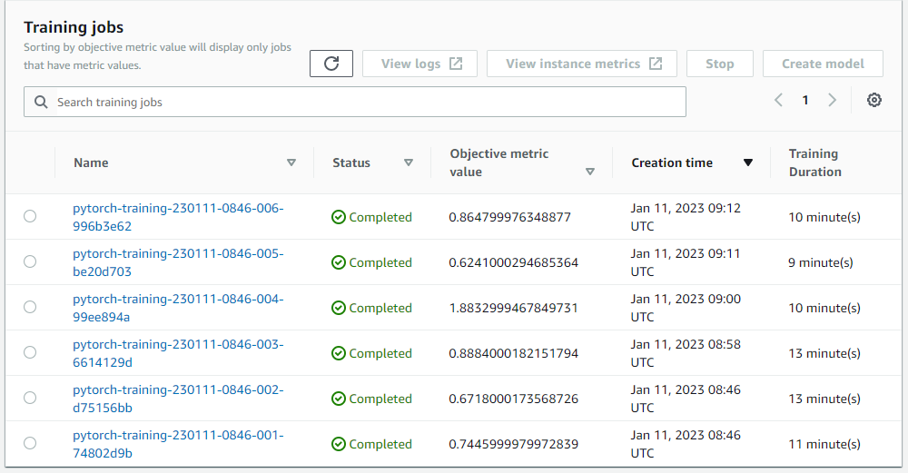
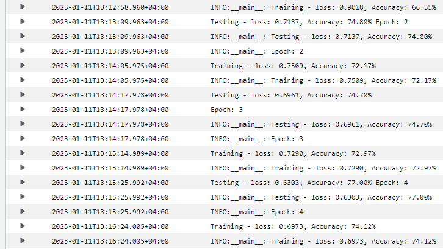
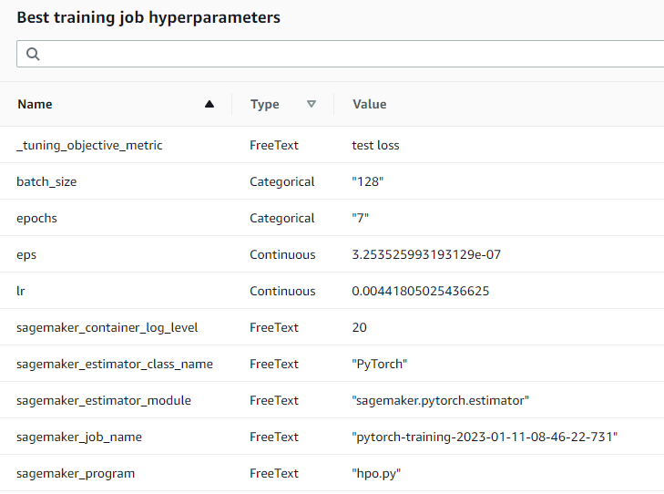
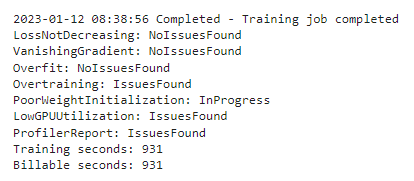
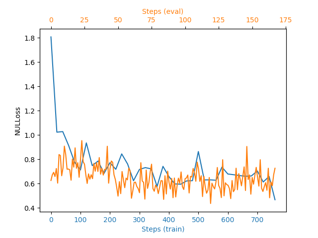
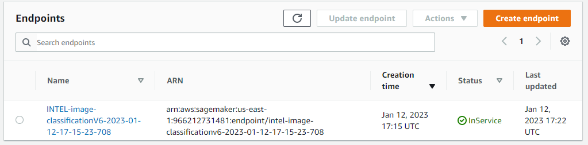
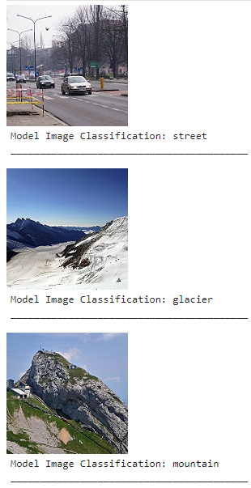
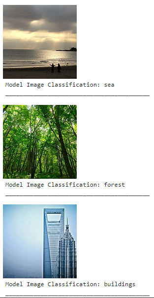

# Image Classification using AWS SageMaker

In this notebook, I fine-tuned the pre-trained model EfficientNet-B7 to use on the Intel Image Classification dataset. First, the tunning is run on the SageMaker training jobs to utilize the ml.g4dn.xlarge instance type. Meanwhile, I used the model profiler and debugger to analyze the generated model. Then I deploy the model and inference random image sets.

## Project Set Up
- AWS Account -> to use SageMaker services
- [train_and_deploy.ipynb](train_and_deploy.ipynb) -> A jupyter notebook that organize our steps. Used to interact with the SageMaker services to tune, monitor, deploy, and test our model.
- [hpo.py](code/hpo.py) -> A Python script that defines the hyperparameter configurations, data loading, and training and testing functions for the tuning job.
- The Python script based on the `train_model.py` with added debugger monitoring. It is used for moel training with the optimal set of hyperparameters.
- [train_model.py](code/train_model.py) -> A Python script contains the same as `hpo.py` codes, but with hooks defined for debugger monitoring.
- [inference.py](inference.py) -> A Python script that overrides some of the deployed model's functions to tell it how to read and process the input images and predict the class.


## Dataset
The data set I'm using is the Intel Image Classification dataset available on (https://www.kaggle.com/datasets/puneet6060/intel-image-classification). This data set consists of images of natural scenes around the world under 6 categories:

- Buildings
- Forest
- Glacier
- Mountain
- Sea
- Street

There are a total of 25k images of size 150x150, distributed between Train, Test, and Prediction files. where, 14k images are in Train, 3k in Test, and 7k in Prediction.

The dataset file structure is like this

```
.   
└───data
    └───seg_train
    │   │   
    │   └───buildings
    │   └───forest
    │   └───glacier
    │   └───mountain
    │   └───sea
    │   └───street
    │
    └───seg_test
    │   │   
    │   └───buildings
    │   └───forest
    │   └───glacier
    │   └───mountain
    │   └───sea
    │   └───street
    │
    └───seg_pred

```
Each category is in a separate file.

### Access
Upload the data to an S3 bucket through the AWS Gateway so that SageMaker has access to the data. 

## Hyperparameter Tuning
The model I chose is EfficientNet-B7. EfficientNet models are known for achieving both higher accuracy and better efficiency over existing CNNs, resulting in reduced parameter size and, thus, better resource optimization. For example, efficientNet-B7 reaches state-of-the-art 84.4% top-1 accuracy on ImageNet while being 8.4x smaller and 6.1x faster on CPU inference. To compare, ResNet-50 achieved 76.3%  accuracy on ImageNet.

The hyperparameters I tuned are batch_size, epoch, learning rate, and epsilon. With the following ranges:

- batch_size = [128, 256, 512]
- epoch = [5, 7, 9]
-  learning rate = (0.001 - 0.1)
- epsilon = (0.0000001 - 0.000001)

I applied 6 different combinations to find the best model using SageMaker Hyperparameter tuning and Training jobs.



Meanwhile, I logged the results of training and testing jobs of every epoch.



The best parameters were:
{'batch_size': 128,
 'epoch': 7,
 'lr': 0.00441805025436625,
 'eps': 3.253525993193129e-07}




## Debugging and Profiling
I set the debugger by creating a hook and setting it to record the loss criterion while training and evaluating.
 
I set the debugger and profiler to monitor the following through Rules:
- LossNotDecreasing
- VanishingGradient
- Overfitting
- Overtraining
- PoorWeightInitialization
- LowGPUUtilization
- ProfilerReport


### Results
I found that there are two issues



The debugging output shows that there is Overtraining issue. This can be fixed by changing the training\testing ratios or by adding an early stopping rule to stop the training when the problem occurs.

There is also an issue with GPU utilization, which happens when GPU usage is low. Increasing the patch size will make the GPU more utilized. It is not a big problem as our images are small in size and resolution, and our GPU can do more.

Moreover, looking at the training and validation loss, the training loss started at 1.8 but decreased rapidly and maintained an average of 0.6 over the next steps. Meanwhile, the validation loss started low and maintained an average of 0.6. The fact that the validation loss kept fluctuating around the same average indicates over-training.




## Model Deployment
For the training, since we have thousands of images, I used ml.g4dn.xlarge instance to utilize its GPU. However, when deploying the image, I used ml.t2.medium, as our images are small and don't require a lot of computation power for inferencing. On a bigger scale, for more customers, one would need to consider better options, but this is more than enough for testing.



Using the images in the seg_pred folder, I picked images at random and used the predicted model to classify them.





To use the Predictor, we pass bytes of a JPEG image, and we get an array of loss values for the 6 different classes, where the indices can be interpreted as follows:

- 0 -> buildings
- 1 -> forest
- 2 -> glacier
- 3 -> mountain
- 4 -> sea
- 5 -> street

## References

https://ai.googleblog.com/2019/05/efficientnet-improving-accuracy-and.html

https://github.com/aws/amazon-sagemaker-examples/blob/main/sagemaker-debugger/pytorch_model_debugging/pytorch_script_change_smdebug.ipynb

https://sagemaker.readthedocs.io/en/stable/frameworks/pytorch/using_pytorch.html#load-a-model

https://aws.amazon.com/blogs/machine-learning/create-amazon-sagemaker-models-using-the-pytorch-model-zoo/#:~:text=The%20entry_point%20parameter%20points%20to,SageMaker%20Deep%20Learning%20Container%20image
